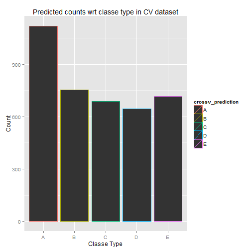
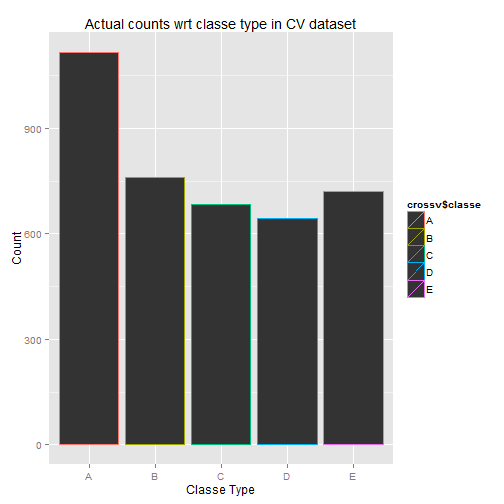

# Practical Machine Learning: Prediction Assignment Writeup


## Background

Using devices such as Jawbone Up, Nike FuelBand, and Fitbit it is now possible to collect a large amount of data about personal activity relatively inexpensively. These type of devices are part of the quantified self movement - a group of enthusiasts who take measurements about themselves regularly to improve their health, to find patterns in their behavior, or because they are tech geeks. One thing that people regularly do is quantify how much of a particular activity they do, but they rarely quantify how well they do it.  
In this project, our goal will be to use data from accelerometers on the belt, forearm, arm, and dumbell of 6 participants. They were asked to perform barbell lifts correctly and incorrectly in 5 different ways. More information is available from the website here:
http://groupware.les.inf.puc-rio.br/har (http://groupware.les.inf.puc-rio.br/har) (see the section on the Weight Lifting Exercise Dataset).


## Data Source

The training data for this project are available here: 

https://d396qusza40orc.cloudfront.net/predmachlearn/pml-training.csv

The test data are available here: 

https://d396qusza40orc.cloudfront.net/predmachlearn/pml-testing.csv

All the data for this project come from this source: http://groupware.les.inf.puc-rio.br/har  
I do thank them very much for letting us use their data in our assignment.

The training dataset was split into training (80%) and Cross Validation (20%).  A model is fit on this new training dataset and then it was used to predict the "classe" on the Cross Validation set and determine the accuracy.


## Data Preprocessing

In this part, we are going to preprocess the data before we move on to the actual analysis.

First of all, we need to get the data:

```r
# NB: everything is done within the current working directory
URL1 <- "https://d396qusza40orc.cloudfront.net/predmachlearn/pml-training.csv"
downloaded_file1 <- "pml-training.csv"
URL2 <- "https://d396qusza40orc.cloudfront.net/predmachlearn/pml-testing.csv"
downloaded_file2 <- "pml-testing.csv"
# Condition to prevent downloading the compressed file each time the script is run
if (!file.exists(downloaded_file1)) {
    download.file(URL1, downloaded_file1)
}
if (!file.exists(downloaded_file2)) {
    download.file(URL2, downloaded_file2)
}
```

Then, we load the two activity data sets:

```r
pml_training <- read.csv("pml-training.csv")
pml_testing <- read.csv("pml-testing.csv")
```

*NB: We are not going to use the pml-testing dataset before the submission part of the assignment*


## Building the Model

In this part, we are building the model with wich we are going to make further predictions on the testing data set.

First of all, we need some packages and we thus load them:

```r
library(lattice)
library(ggplot2)
library(caret)
library(stats)
library(randomForest)
```

```
## randomForest 4.6-7
## Type rfNews() to see new features/changes/bug fixes.
```

*In this kind of analysis, it seems that random forests are quite good in predicting the results. This is thus what we are going to use.*

I decided to partition the training data set such that 80% falls into the real training data set and the other 20% becomes the Cross-Validation dataset:

```r
inTrain <- createDataPartition(y = pml_training$classe, p = 0.8, list = FALSE)
training <- pml_training[inTrain, ]
crossv <- pml_training[-inTrain, ]
```

After some side tests while running it I chose to set the computation control of the training function to make it run much faster, instead of using the default ***bootstrapping*** method:

```r
training_control = trainControl(method = "cv", number = 4, allowParallel = TRUE)
```

A quick summary on the training data set tells us the latter has 159 variables.  
According to the documentation, the ***Classe*** feature as well as 52 other features which gather sensor data are the ones we are going to deal with in order to adress the question of this assignment.  

We will use the previously chosen training control to fit our model:

```r
modFit <- train(classe ~ roll_belt + pitch_belt + yaw_belt + total_accel_belt +
                  gyros_belt_x + gyros_belt_y + gyros_belt_z + accel_belt_x + 
                  accel_belt_y + accel_belt_z + magnet_belt_x + magnet_belt_y + 
                  magnet_belt_z + roll_arm + pitch_arm + yaw_arm + total_accel_arm + 
                  gyros_arm_x + gyros_arm_y + gyros_arm_z + accel_arm_x + accel_arm_y + 
                  accel_arm_z + magnet_arm_x + magnet_arm_y + magnet_arm_z + 
                  roll_dumbbell + pitch_dumbbell + yaw_dumbbell + total_accel_dumbbell + 
                  gyros_dumbbell_x + gyros_dumbbell_y + gyros_dumbbell_z + accel_dumbbell_x + 
                  accel_dumbbell_y + accel_dumbbell_z + magnet_dumbbell_x + magnet_dumbbell_y + 
                  magnet_dumbbell_z + roll_forearm + pitch_forearm + yaw_forearm + 
                  total_accel_forearm + gyros_forearm_x + gyros_forearm_y + gyros_forearm_z + 
                  accel_forearm_x + accel_forearm_y + accel_forearm_z + magnet_forearm_x + 
                  magnet_forearm_y + magnet_forearm_z, 
                method = "rf", data = training, trControl = training_control)
```


## Results

We shall now present and discuss the results.  

First let's determine the accuracy of the model fit:

```r
print("The training result accuracy is:"); modFit$results[2, 2]
```

```
## [1] "The training result accuracy is:"
```

```
## [1] 0.9917
```

Then, let's get the training error rate:

```r
trainingerrorrate <- 1 - as.numeric(modFit$results[2, 2])
print("The training error rate is:"); trainingerrorrate
```

```
## [1] "The training error rate is:"
```

```
## [1] 0.008281
```

We will then predict the outcome for the Cross Validation dataset based on the model fit from the training dataset:

```r
crossv_prediction <- predict(modFit, crossv)
```

We then compute the out of sample error rate and the accuracy of the Cross Validation:

```r
crossvaccuracy <- postResample(crossv_prediction, crossv$classe)
errorrate<- 1 - as.numeric(crossvaccuracy[1])
print("The expected out of sample error rate is:"); errorrate
```

```
## [1] "The expected out of sample error rate is:"
```

```
## [1] 0.005863
```

```r
print("The CV accuracy based on the prediction is:"); crossvaccuracy[1]
```

```
## [1] "The CV accuracy based on the prediction is:"
```

```
## Accuracy 
##   0.9941
```

As we can see, the accuracy of the model fit on the training dataset is approximately 99%, thus giving us an error rate of around 1%.  
When using this model on the Cross Validation dataset, our accuracy gets even greater than 99% and decreases our error rate to even less than 1%.

***Our built model seems to do a pretty good job on this provided trainng dataset.***


## Some Graphics

We are going to show two graphs:

1. The first one for the predicted counts in each classe type in the Cross Validation dataset.
2. The second one for the actual counts in each classe type in the Cross Validation dataset.


```r
predicted_plot <- qplot(crossv_prediction, color = crossv_prediction, 
                        main = "Predicted counts wrt classe type in CV dataset", 
                        xlab = "Classe Type", ylab = "Count")
actual_plot <- qplot(crossv$classe, color = crossv$classe, 
                     main = "Actual counts wrt classe type in CV dataset",
                     xlab = "Classe Type", ylab = "Count")
print(predicted_plot)
```

 

```r
print(actual_plot)
```

 

We see the plots are almost identical, conforting us on the nice job done by our model.


## Predictions on the Testing Dataset to use for the Submission part

In this part, we are just using our built model to predict the outcomes of the testing dataset in order to get our 20 answers for the submission part of the assignment.


```r
print("Predicted outcomes for the pml-testing dataset:"); predict(modFit, pml_testing)
```

```
## [1] "Predicted outcomes for the pml-testing dataset:"
```

```
##  [1] B A B A A E D B A A B C B A E E A B B B
## Levels: A B C D E
```

We then use the provided code on the [Prediction Assignment Submission: Instructions webpage](https://class.coursera.org/predmachlearn-002/assignment/view?assignment_id=5) in order to create the 20 answers text files to submit on the [submission webpage](https://class.coursera.org/predmachlearn-002/assignment/):


```r
# Using our model to predict on the testing-pml dataset
answers <- predict(modFit, pml_testing)

# Mere copy-paste of the function provided
pml_write_files = function(x){
  n = length(x)
  for(i in 1:n){
    filename = paste0("problem_id_",i,".txt")
    write.table(x[i],file=filename,quote=FALSE,row.names=FALSE,col.names=FALSE)
  }
}

# Creating the answers text files
pml_write_files(answers)
```
